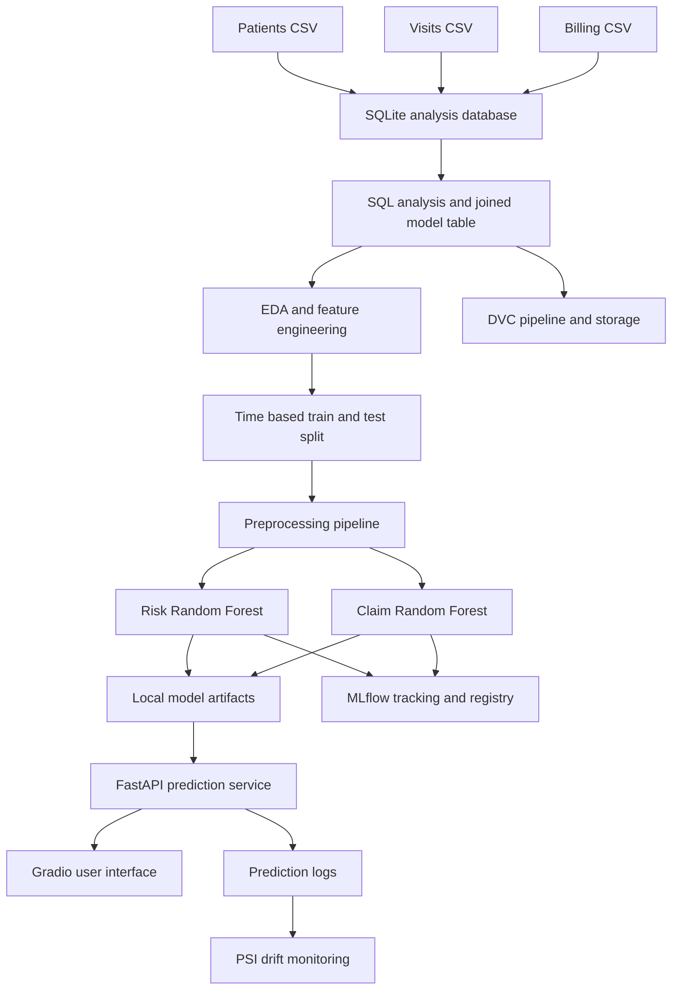
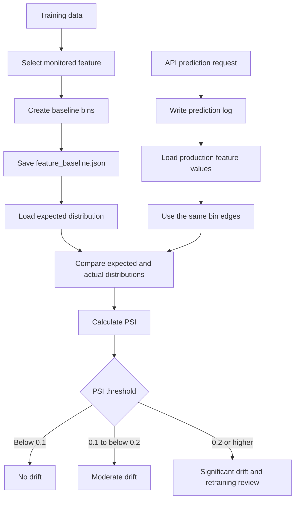
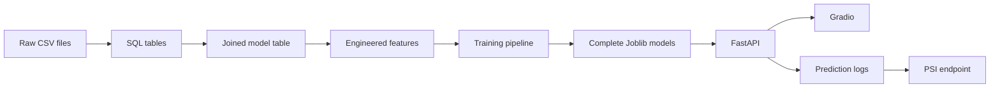

# HealthOps AI

## Project Overview

I built HealthOps AI as a healthcare operations machine learning project. My aim was to connect data analysis, machine learning, model management, APIs, a user interface, and monitoring into one working solution.

The project answers two operational questions:

1. What is the expected risk level of a patient visit?
2. What is the likely outcome of the related insurance claim?

The first model predicts `Low`, `Medium`, or `High` patient risk. The second model predicts whether a claim is `Paid`, `Pending`, or `Rejected`. These predictions can help healthcare teams prioritize attention, understand operational pressure, and identify claims that may require earlier follow-up.

This is not only a model training exercise. I have organized the project as a complete machine learning workflow, starting with raw CSV data and ending with API predictions, a Gradio interface, model artifacts, experiment tracking, data versioning, and drift monitoring.

## Business Problem

Healthcare organizations collect information about patients, visits, departments, doctors, insurance providers, length of stay, and billing. When this information is reviewed manually, it is difficult to identify high-risk visits quickly and difficult to prioritize claims that may be rejected.

This creates several business problems:

- High-risk patients may not be prioritized early enough.
- Clinical workload can be difficult to compare across departments and doctors.
- Rejected claims can delay revenue realization.
- Insurance providers may have different rejection patterns.
- Long patient stays and high billing amounts may require additional operational review.
- A model can lose accuracy after deployment when real-world input distributions change.

My solution uses historical healthcare operations data to learn patterns in patient visits and billing. The risk prediction supports patient and visit prioritization. The claim prediction supports revenue-cycle review. The monitoring component is intended to warn when production data no longer resembles the training baseline.

## Solution Approach

I used a layered approach so that each part of the project has a clear responsibility:

1. I loaded and validated the source data.
2. I created a relational analysis layer with SQLite.
3. I joined patient, visit, and billing information into one modeling table.
4. I explored distributions, missing values, outliers, correlations, and class balance.
5. I created features that represent patient history, visit timing, cost, and provider behavior.
6. I compared multiple classification algorithms.
7. I selected a time-based train and test split to better represent future prediction.
8. I packaged preprocessing and modeling together in complete scikit-learn pipelines.
9. I logged experiments and registered models with MLflow.
10. I exposed the models through FastAPI and a Gradio interface.
11. I added DVC configuration for repeatable data and model versioning.
12. I added prediction logging and PSI-based feature drift monitoring.

### Why This Approach Fits This Project

The approach is appropriate for this project for several reasons.

First, patient, visit, and billing data belong to different operational areas. A database layer makes it easier to validate relationships and answer business questions before modeling. It also makes the joins explicit instead of hiding them inside one large modeling script.

Second, healthcare data is time-dependent. A random split can allow future patterns to influence the training set while the model is being evaluated on older records. I used visit date for the risk model and billing date for the claim model, training on the earlier records and testing on the later records. This better represents the way the models would be used in practice.

Third, the data contains both numeric and categorical information. The complete pipelines impute missing numeric values, impute categorical values, one-hot encode categories, and then train the classifier. Saving these steps with the model prevents the API from applying preprocessing differently from the training process.

Fourth, the risk and claim targets have different operational meanings. I therefore trained separate models and used different target-focused recall measurements. Missing a high-risk visit is important for the risk workflow. Missing a rejected claim is important for the billing workflow.

Finally, a production model needs more than an accuracy score. MLflow records the experiments and artifacts, DVC records pipeline dependencies and outputs, FastAPI serves predictions, and monitoring creates a path for checking production behavior.

## Data Used

The project uses three source tables.

### Patients

`data/patients.csv` contains 5,000 patients and 7 fields:

- `patient_id`
- `age`
- `gender`
- `city`
- `insurance_provider`
- `chronic_flag`
- `registration_date`

### Visits

`data/visits.csv` contains 25,000 visits and 8 fields:

- `visit_id`
- `patient_id`
- `visit_date`
- `department`
- `visit_type`
- `length_of_stay_hours`
- `risk_score`
- `doctor_id`

### Billing

`data/billing.csv` contains 25,000 billing records and 7 fields:

- `bill_id`
- `visit_id`
- `billed_amount`
- `approved_amount`
- `claim_status`
- `payment_days`
- `billing_date`

The SQL analysis confirmed 25,000 joined visit and billing records, no orphan visits or billing records, no duplicate patient identifiers, and no missing values in the three raw tables. In the joined data, missing approved amounts and payment days are expected for claims that are not resolved yet.

## End-to-End Architecture



The architecture follows the path of the data. Raw files are analyzed and joined first. The resulting table is enriched and used for training. The trained pipelines are saved locally and logged to MLflow. The API loads the local complete pipelines for inference. The Gradio application calls the API rather than loading models directly. Predictions are logged for later monitoring.

## Notebook and Analysis Workflow

### Notebook 1: SQL Analysis Layer

`notebooks/01_SQL_Analysis_Layer.ipynb` creates the analysis foundation.

The notebook loads the three CSV files, creates `db/hospita.db`, and writes the `patients`, `visits`, and `billing` tables. It then analyzes department workload, high-risk cases by doctor, patient visit frequency, risk by department, insurance billing outcomes, provider rejection patterns, revenue realization, and data quality.

The notebook joins the three tables into an initial 20-column `model_table` and saves it to `outputs/model_table.csv`.

### Notebook 2: EDA Layer

`notebooks/02_EDA_Layer.ipynb` examines the joined dataset in more detail.

The notebook parses date fields, checks nulls and invalid values, examines paid claims and payment days, reviews length-of-stay outliers, and visualizes department, visit type, insurance provider, city, age, and length-of-stay distributions.

It encodes the target labels for analysis and creates the following engineered features:

- `days_since_registration`
- `visit_frequency`
- `avg_los_per_patient`
- `provider_rejection_rate`
- `visit_month`
- `visit_dayofweek`
- `high_cost_visit_flag`

The enriched table is saved back to `outputs/model_table.csv`. This makes the output of the analysis layer the input of the modeling layer.

### Notebook 3: Modeling

`notebooks/03_Modeling.ipynb` compares Logistic Regression, Random Forest, and XGBoost models for both targets. It sorts the data by the relevant date, uses the earliest 80 percent for training, and uses the latest 20 percent for testing.

The notebook saves the earlier modeling artifacts as `models/risk_model.joblib` and `models/claim_model.joblib`. The production training pipeline later creates the complete pipeline artifacts with preprocessing included.

### Notebook 4: MLflow Experiment Tracking

`notebooks/04_MLFLOW_Experiment_tracking.ipynb` demonstrates experiment tracking with MLflow. It logs model parameters, metrics, and artifacts, registers the risk model, moves it through Staging and Production, loads the production version, and records a sample prediction.

The production command-line training workflow in `src/training_pipeline.py` performs the same general lifecycle against the configured MLflow server.

## Analysis Results and Insights

The analysis produced several useful operational observations.

### Claim outcomes

The claim distribution is:

| Claim status | Records | Share |
| --- | ---: | ---: |
| Paid | 13,638 | 54.55 percent |
| Pending | 6,096 | 24.38 percent |
| Rejected | 5,266 | 21.06 percent |

Paid claims are the majority, but more than one in five claims are rejected. That makes claim prediction useful for prioritizing review, while also making class-aware evaluation necessary.

### Provider behavior

The recorded rejection rates were approximately 25.7 percent for CareOne, 24.3 percent for MediCareX, and 15.7 percent for SecureLife. These differences suggest that insurance provider is an important operational feature and may help a billing team focus review effort.

### Visit and stay patterns

The most common recorded departments include General, Cardiology, ER, and ICU. OPD is the most common visit type, followed by ER and ICU. The EDA identified 1,136 length-of-stay outliers using the IQR method, with an upper bound of approximately 65.2 hours.

### High-cost visits

The EDA used the 75th percentile of billed amount, approximately 59,711, to create `high_cost_visit_flag`. This converts a continuous financial measure into a feature that can support claim review and operational prioritization.

### Multiple model comparison

I compared three algorithms for each prediction task. The scores below come from the time-based notebook evaluation, where the earliest 80 percent of records were used for training and the latest 20 percent were used for testing.

| Target | Algorithm | Test accuracy | Weighted F1 | Result |
| --- | --- | ---: | ---: | --- |
| Risk score | Logistic Regression | 0.9090 | 0.9096 | Baseline model |
| Risk score | Random Forest | 0.9346 | 0.9346 | Strong tree-based model |
| Risk score | XGBoost | 0.9530 | 0.9531 | Highest notebook score |
| Claim status | Logistic Regression | 0.4044 | 0.4183 | Weak baseline |
| Claim status | Random Forest | 0.5000 | 0.4879 | Selected production pipeline |
| Claim status | XGBoost | 0.5448 | 0.4719 | Higher accuracy, lower weighted F1 |

The notebook comparison selected XGBoost by accuracy during experimentation. The implemented production pipeline uses Random Forest for both targets because the project has a single, consistent pipeline implementation with controlled depth, minimum sample sizes, class balancing, and local serialized artifacts. For the claim model, accuracy alone is not enough because the operational objective is to identify rejected claims, so rejected-class recall must also be considered.

### MLflow results

The production training workflow logs the complete preprocessing and model pipelines to MLflow. It records accuracy, weighted F1, and recall for the target class used in the production decision. The following results were recorded in MLflow:

| Target | MLflow run ID | Accuracy | Weighted F1 | Target recall | Accuracy gate | Recall gate | Promotion result |
| --- | --- | ---: | ---: | ---: | ---: | ---: | --- |
| Risk score | `1cf54ecc0542447a9be15c121c582c64` | 0.9346 | 0.9346 | High: 0.9296 | 0.55 | 0.70 | Eligible for Production |
| Claim status | `8418f18f18234938bfa9a7802fcb4a27` | 0.5000 | 0.4879 | Rejected: 0.3010 | 0.55 | 0.70 | Not eligible for Production |

The risk model passed both configured MLflow promotion gates. The claim model passed the accuracy gate but failed the rejected-claim recall gate. This is why the risk model is suitable for the current production workflow, while the claim model should be treated as an experimental or assisted-review model until its rejected-class recall improves.

The risk model satisfies the configured production gates of at least 0.55 accuracy and at least 0.70 target recall. The claim model satisfies the accuracy gate but does not satisfy the rejected-claim recall gate. I therefore treat the claim model as a useful experiment and API artifact, but not as evidence that rejected claims can yet be identified reliably enough for an automated production decision.

## Feature Importance and Feature Design

I used several types of features because no single field describes a healthcare visit completely.

### Patient features

Age, gender, city, insurance provider, and chronic condition status describe the patient context. Chronic condition status can represent additional clinical complexity. Age and chronic status are numeric inputs, while the demographic and provider fields are categorical inputs.

### Visit features

Department, visit type, doctor identifier, length of stay, month, and day of week describe the operational context of the visit. Department and visit type can capture different levels of care. Length of stay can indicate complexity or resource use. Calendar fields can represent seasonal or weekly patterns.

### Historical behavior features

Visit frequency and average length of stay per patient add context that a single visit cannot provide. Days since registration measures the relationship between the patient and the organization over time.

### Financial and provider features

Billed amount and high-cost status are important for claim operations. Provider rejection rate summarizes historical behavior by insurance provider and gives the claim model a business-level signal rather than relying only on one claim.

### Target-specific design

The risk model uses 14 input features and predicts `risk_score`. The claim model uses 18 input features and predicts `claim_status`. The claim model also uses the predicted or supplied `risk_score`, so claim prediction depends on that risk value being available in the request.

The production pipelines use median imputation for numeric features, most-frequent imputation for categorical features, one-hot encoding with unknown-category handling, and a Random Forest classifier. The Random Forest uses 200 trees, maximum depth 8, minimum split size 20, minimum leaf size 10, balanced subsampling, and `random_state=42`.

## Implementation Process

### Step 1: Load and validate the source data

I begin with patients, visits, and billing data. I check identifiers, row counts, missing values, duplicates, orphan relationships, dates, payment fields, and length-of-stay values.

### Step 2: Build the SQL analysis layer

The first notebook creates a SQLite database and stores the source data as relational tables. This gives me a repeatable place to perform joins and operational queries.

### Step 3: Create the modeling table

I join patient information to visits and billing information through the patient and visit identifiers. The joined data is saved as `outputs/model_table.csv`.

### Step 4: Perform EDA and create features

I examine distributions, class balance, correlations, outliers, provider rejection rates, and operational patterns. I then add historical, calendar, cost, and provider features.

### Step 5: Compare candidate models

I compare Logistic Regression, Random Forest, and XGBoost. I use accuracy and weighted F1 for overall comparison, while also checking recall for the target class that matters operationally.

### Step 6: Train with time-aware evaluation

The risk workflow sorts by `visit_date`. The claim workflow sorts by `billing_date`. The first 80 percent is used for training and the later 20 percent is used for testing.

### Step 7: Save complete pipelines

The production training code in `src/training_pipeline.py` saves complete preprocessing and model pipelines to the `models` directory. The feature definitions are also written to `outputs/feature_schema.json`.

### Step 8: Track and register models

MLflow records parameters, target columns, date columns, metrics, and serialized model artifacts. Eligible models can be registered and moved to Production. The configured eligibility rule requires accuracy of at least 0.55 and target recall of at least 0.70.

### Step 9: Serve predictions

FastAPI validates request bodies with Pydantic schemas, loads a complete local model pipeline, creates a one-row DataFrame, returns the predicted class and probabilities when available, and writes a prediction log entry.

### Step 10: Use the interface

The Gradio application provides separate Risk Prediction and Claim Prediction tabs. It sends requests to FastAPI. In Docker Compose, the UI calls the API through the internal service name `http://api:8000`.

### Step 11: Monitor production behavior

The monitoring code uses Population Stability Index for `length_of_stay_hours`. The baseline uses distribution `[0.2, 0.5, 0.3]` and bin edges `[0, 24, 72, 200]`. PSI below 0.1 means no drift, 0.1 to below 0.2 means moderate drift, and 0.2 or higher means significant drift and a retraining recommendation.

## PSI Monitoring Workflow

I use Population Stability Index, or PSI, to compare the feature distribution seen during training with the feature distribution observed after deployment. In this project, the monitored feature is `length_of_stay_hours`.

PSI does not measure whether an individual prediction is correct. It measures whether the population of incoming values has changed. A large change can indicate a change in patient mix, department behavior, data collection, or operational conditions. It is a signal for investigation and possible retraining, not an automatic diagnosis or clinical decision.

### PSI monitoring flow



### How PSI is calculated in this project

The calculation has five stages:

1. I select `length_of_stay_hours` as the feature to monitor.
2. I load the training baseline from `outputs/feature_baseline.json`.
3. I read production records from `logs/predictions.log` and collect the feature values.
4. I place the production values into the same bins used for the training baseline.
5. I compare the expected and actual proportions and return the PSI value and status.

The project baseline is:

| Length of stay bin | Bin range | Expected training share |
| --- | --- | ---: |
| Bin 1 | 0 to below 24 hours | 0.20 |
| Bin 2 | 24 to below 72 hours | 0.50 |
| Bin 3 | 72 to 200 hours | 0.30 |

The bin edges are `[0, 24, 72, 200]`. Using the same edges for training and production is important because a different set of bins would make the distributions difficult to compare.

For each bin, I calculate the contribution using:

$$
PSI_i = (Actual_i - Expected_i) \times \ln\left(\frac{Actual_i}{Expected_i}\right)
$$

The total PSI is the sum of the contributions from all bins:

$$
PSI = \sum_{i=1}^{n} (Actual_i - Expected_i) \times \ln\left(\frac{Actual_i}{Expected_i}\right)
$$

The implementation uses a small value of `0.000001` whenever a proportion is zero. This prevents a logarithm of zero and allows the monitor to return a usable value.

### Example calculation using this project baseline

Suppose ten production visits produce the following distribution:

| Length of stay bin | Expected share | Actual production share |
| --- | ---: | ---: |
| Bin 1 | 0.20 | 0.40 |
| Bin 2 | 0.50 | 0.40 |
| Bin 3 | 0.30 | 0.20 |

The PSI contributions are:

$$
\begin{aligned}
PSI_1 &= (0.40 - 0.20) \times \ln(0.40 / 0.20) = 0.1386 \\
PSI_2 &= (0.40 - 0.50) \times \ln(0.40 / 0.50) = 0.0223 \\
PSI_3 &= (0.20 - 0.30) \times \ln(0.20 / 0.30) = 0.0405 \\
PSI &= 0.1386 + 0.0223 + 0.0405 = 0.2014
\end{aligned}
$$

The result is approximately `0.2014`, which is at or above `0.2`. The monitoring response would therefore classify this as `Significant drift - retrain recommended`.

### Monitoring thresholds

| PSI value | Interpretation in this project | Action |
| --- | --- | --- |
| Below 0.1 | No drift | Continue monitoring |
| 0.1 to below 0.2 | Moderate drift | Investigate the feature and data source |
| 0.2 or higher | Significant drift | Review the model and consider retraining |

The API exposes this workflow through `GET /monitor/psi`. The endpoint returns the feature name, records used, expected distribution, actual distribution, bin edges, PSI score, status, and threshold values. The monitor requires at least 10 usable production values before it calculates PSI.

### Current implementation behavior

The intended monitoring flow is complete in `monitoring/drift_monitor.py`, but the current log format has an integration limitation. `monitoring/logger.py` writes the original input as an SHA-256 `input_hash`, while `load_prediction_logs()` currently looks for an `input_data` object containing the raw feature values. Because the existing records contain the hash but not `input_data`, the current `/monitor/psi` endpoint reports that no usable production prediction logs are available.

To make the calculation work with real API traffic, the logging design must retain an appropriate privacy-aware representation of the monitored feature, such as the length-of-stay value or an approved aggregated monitoring record. After at least 10 usable records are available, the endpoint can build the actual distribution and calculate PSI using the workflow above.

## API and User Interface

The FastAPI service is defined in `api/main.py`.

| Method | Endpoint | Purpose |
| --- | --- | --- |
| GET | `/` | Confirm that the API is running |
| GET | `/health` | Health check |
| POST | `/predict/risk` | Predict `Low`, `Medium`, or `High` risk |
| POST | `/predict/claim` | Predict `Paid`, `Pending`, or `Rejected` claim status |
| GET | `/monitor/psi` | Run the PSI monitoring endpoint |

The API currently serves the complete local Joblib pipelines. MLflow is used for tracking and registration, but the API does not currently load models directly from the MLflow Registry.

## Project Structure

```text
HealthOps-AI/
+-- api/                         FastAPI application, routes, schemas, and prediction services
+-- data/                        Source patients, visits, and billing CSV files
+-- db/                          SQLite analysis database
+-- logs/                        JSON Lines prediction logs
+-- models/                      Local serialized model pipelines
+-- monitoring/                  Prediction logging and PSI drift monitoring
+-- notebooks/                   SQL analysis, EDA, modeling, and MLflow notebooks
+-- outputs/                     Modeling table, feature schema, and drift baseline
+-- src/                         Configuration, training, evaluation, and utilities
+-- tests/                       Route, schema, and artifact tests
+-- ui/                          Gradio prediction interface
+-- dvc.yaml                     Reproducible training stages
+-- docker-compose.yml           API and UI services
+-- Dockerfile.api               API container definition
+-- Dockerfile.gradio            Gradio container definition
`-- requirements.txt              Python dependencies
```

The implementation flow is:



## Tools and Technologies

### Python data and machine learning

Pandas and NumPy support data preparation and numerical operations. Scikit-learn supplies preprocessing, pipelines, classification models, and evaluation. XGBoost is included for model comparison. Joblib stores local trained model artifacts.

### SQL and database analysis

SQLite provides a lightweight relational layer for source tables, joins, quality checks, and operational analysis. SQL is useful here because the data naturally represents patients, visits, and billing relationships.

### Jupyter notebooks

Jupyter provides a transparent place to inspect data, document analysis, visualize distributions, test features, and compare models before moving the repeatable training path into Python modules.

### MLflow

MLflow tracks parameters, metrics, runs, artifacts, and registered model versions. This creates a record of how a model was trained and supports a staging and production lifecycle.

### DVC

DVC defines training stages and their dependencies. The repository is configured with local DVC storage and an S3 remote, allowing data and generated model outputs to be versioned separately from source code.

### FastAPI and Pydantic

FastAPI exposes prediction and monitoring endpoints. Pydantic schemas validate the input contract before data reaches the model.

### Gradio

Gradio provides a simple operational interface for testing risk and claim predictions without requiring users to write API requests.

### Docker Compose

Docker Compose runs the API and Gradio services together. The API is available on port 8000 and the Gradio interface is available on port 7860.

### Pytest

The tests check the main routes, the feature schema artifact, and the presence of complete model artifacts. They provide a basic regression check for the repository structure and service availability.

## Running the Project

### Install dependencies

I use Python 3.11 for the containerized setup.

```bash
python -m venv .venv
source .venv/bin/activate
pip install -r requirements.txt
```

### Run the tests

```bash
pytest -q
```

### Train the models

The DVC stages and the command-line training module use the following commands:

```bash
python -m src.training_pipeline --model risk
python -m src.training_pipeline --model claim
```

The training pipeline expects an MLflow server at `http://127.0.0.1:5000`.

### Start the API locally

```bash
uvicorn api.main:app --reload --port 8000
```

The interactive API documentation is then available at `http://127.0.0.1:8000/docs`.

### Start the Gradio interface locally

```bash
python ui/gradio_app.py
```

The interface is available at `http://127.0.0.1:7860` when the API is running.

### Run with Docker Compose

```bash
docker compose up --build
```

The API is exposed at `http://localhost:8000`, and the Gradio interface is exposed at `http://localhost:7860`.

## DVC and CI Workflow

The DVC pipeline contains two stages:

- `train_risk` depends on `outputs/model_table.csv` and `src`, and produces the risk model and feature schema.
- `train_claim` depends on the model table, feature schema, and `src`, and produces the claim model.

The CI workflow pulls DVC data and runs the route, schema, and artifact tests. The configured DVC remote is S3, so CI requires the appropriate AWS credentials and access to the configured bucket.

## Current Limitations and Next Improvements

I am documenting these limitations because they affect how the current result should be used.

The claim model has only 0.3010 recall for rejected claims, below the configured target of 0.70. I would improve this by reviewing label quality, adding stronger billing and provider features, tuning for rejected-claim recall, testing class-specific thresholds, and evaluating a cost-sensitive objective.

The production prediction logger currently stores an input hash rather than the original feature values. The PSI reader expects `input_data` in each record. As a result, the current log records cannot provide the feature values needed by the PSI calculation, and the monitoring endpoint reports that usable production records are unavailable. The next implementation step should be to store an appropriate, privacy-aware feature payload or a separately secured monitoring representation.

The API loads local Joblib files on each prediction request. A next step would be to load a validated model version from MLflow or cache the loaded model during application startup.

The current tests check route availability and artifact presence, but they do not yet test real predictions, probability outputs, exact request schemas, logging contents, drift values, or model quality thresholds. These are important additions before using the system for higher-stakes decisions.

The repository contains Docker configuration and deployment-related tools, but it does not yet contain Kubernetes manifests. A future deployment stage could add those manifests, secret management, health probes, resource limits, and a managed model registry workflow.

## Conclusion

HealthOps AI demonstrates how I moved from healthcare operations data to an end-to-end machine learning service. The project combines relational analysis, exploratory work, feature engineering, time-aware model evaluation, model tracking, reproducible training, API serving, a user interface, and monitoring.

The risk model currently shows strong results, especially for high-risk recall. The claim model shows that claim-status prediction is harder and still needs improvement before it should drive automated rejected-claim decisions. That distinction is important: the project is useful both as a working healthcare ML prototype and as a clear foundation for the next round of model and monitoring improvements.